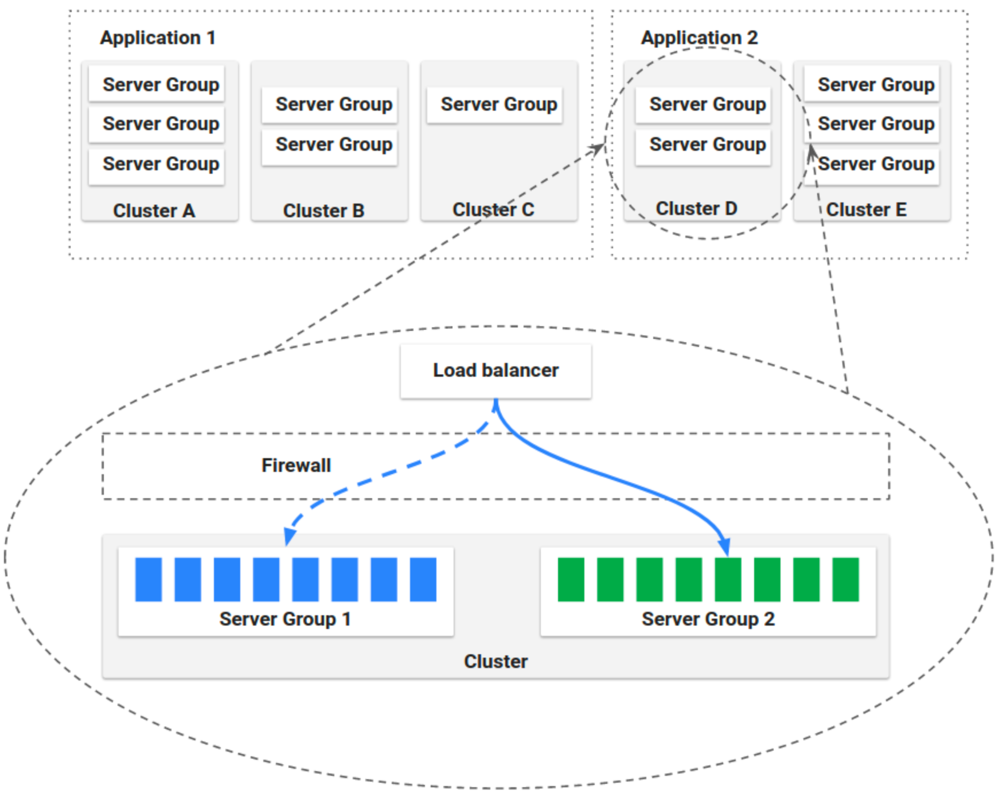

# Cost optimizing your deployments using Spinnaker and EC2 Spot

Samples and documentation for deploying workloads on Amazon EC2 Spot using Spinnaker.

## Overview

Amazon EC2 Spot Instances are spare compute capacity in the AWS Cloud available to you at steep discounts compared to [On-Demand Instance prices](https://aws.amazon.com/ec2/pricing/on-demand/). The only difference between an On-Demand Instance and a Spot Instance is that a Spot Instance can be [interrupted](https://docs.aws.amazon.com/AWSEC2/latest/UserGuide/spot-interruptions.html) by Amazon EC2 with two minutes of notification when EC2 needs the capacity back. Using Spot Instances for all or portion of the compute is an extremely popular usage pattern for workloads such as Web services, batch processing, ML training workloads, big data ETLs using Apache Spark, queue processing applications, and CI/CD pipelines. For example, deploying a interruption tolerant microservice is a great fit for Spot Instances, because the instances can be replaced gracefully when the Spot Instances are interrupted. 

Lets review some Spot [best practices](https://docs.aws.amazon.com/AWSEC2/latest/UserGuide/spot-best-practices.html) that will help you achieve scale and minimize the number of interruptions. Instance type and Availability Zone flexibility helps you tap into multiple Spot Instance pools (a combinations of an Instance type and an Availability Zone) to achieve your desired scale. When combined that with the [capacity-optimized](https://aws.amazon.com/blogs/aws/capacity-optimized-spot-instance-allocation-in-action-at-mobileye-and-skyscanner/) allocation strategy, which allocates instances from the Spot Instance pools with the optimal capacity making use of real-time capacity data, will help you reducing the possibility of interruptions.

## Spinnaker and Spot Instances

*Applications*, *clusters*, and *server groups* are the key concepts Spinnaker uses to describe your services. Load balancers and firewalls describe how your services are exposed to users. 

An Application is a collection of Clusters, a Cluster is a collection of Server Groups, and a server group, identifies the deployable artifact and basic configuration settings such as number of instances, autoscaling policies, metadata, etc. which corresponds an [Auto Scaling group](https://docs.aws.amazon.com/autoscaling/ec2/userguide/AutoScalingGroup.html) in AWS.

# What will be covered

- [**Setup Spinnaker**](spinnaker-setup.md)  
This workshop shows you how to deploy a fully functional compute cluster based on IBM Spectrum LSF.  The environment includes all resources required to run an EDA verification workload on a sample design. Using standard LSF commands, you can quickly add compute capacity to satisfy verification workload demand.

- [**Deploy a sample application**](deploy-demo-app-using-spinnaker.md)
This module shows you how to deploy a sample web application on EC2 Spot following the Spot best practices like Instance flexibility and capacity oprimized allocation strategy while using the unlimited cpu credit specification for burstable perfoemance instance families like T2 and T3.

## License Summary

This sample code is made available under the MIT-0 license. See the LICENSE file.
