# Deploy a sample application using Spinnaker

## Create a Spinnaker Application

We will start with create an application in Spinnaker, which will be the placeholder for the service we will be deploying. From the top navigation bar choose *Applications*, then Create Application. Enter the name of the application and owner email.

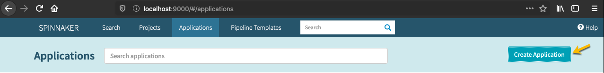

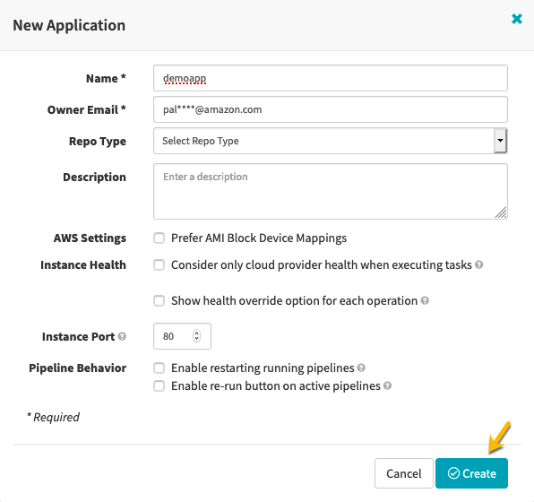


Once you have created a new application, Spinnaker takes you to the Infrastructure section of the application.

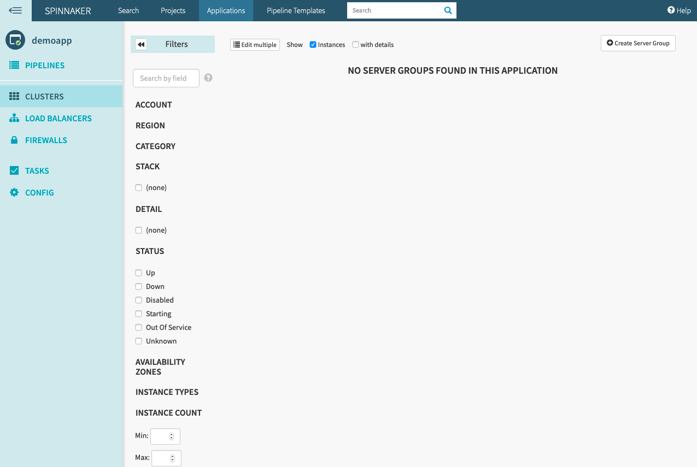

## Create a Load Balancer

Click on *LOAD BALANCERS* on the left navigation and Click *Create Load Balancer* on the right hand top corner. 

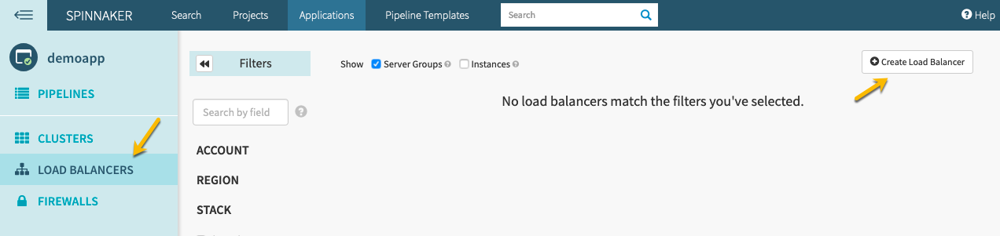

Select *Application (ALB)* for type and click on *Configure Load Balancer* button.

Select the *public-subnet* for VPC Subnet and *Demo-ALB-SecurityGroup* for Firewalls to deploy the ALB into the public subnet spanning multiple Availability Zones that has public access on port 80.

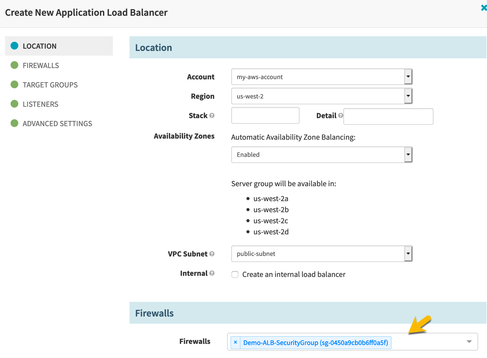

Change the Healthcheck default path from */healthcheck* to */* and click *Create*

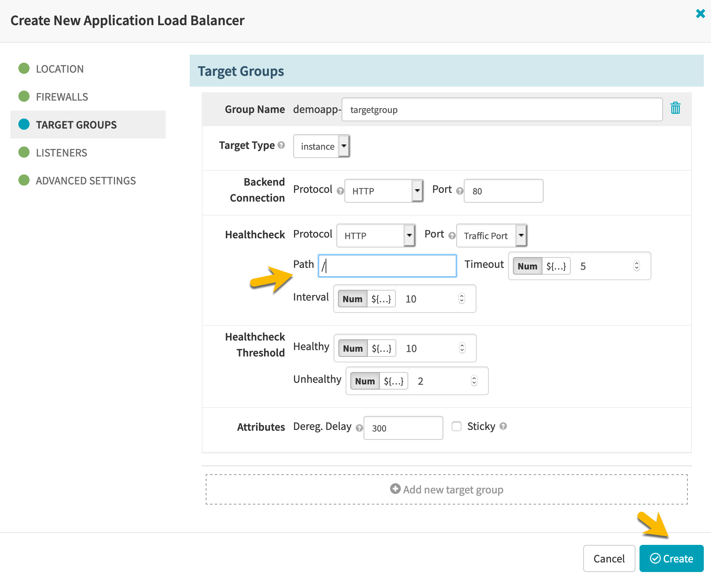

Once Spinnaker deployed the ALB, you can see the settings on the ALB by expanding each section on the right.

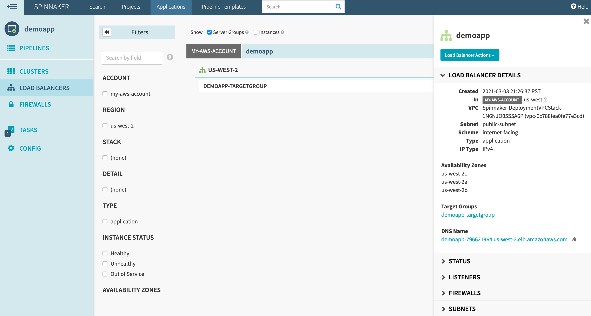

## Create a Server Group

Click on *CLUSTERS* on the left navigation and click *Create Server Group *  

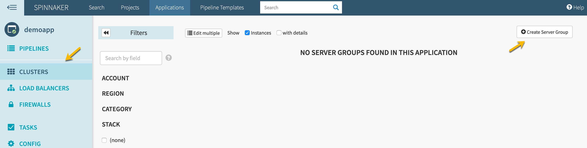

Click on the *Search All Images* link under the Image, search for amzn2-ami-hvm-2.0.2021 and select the first option which will be the one of the version of the Amazon Linux 2 AMIs.

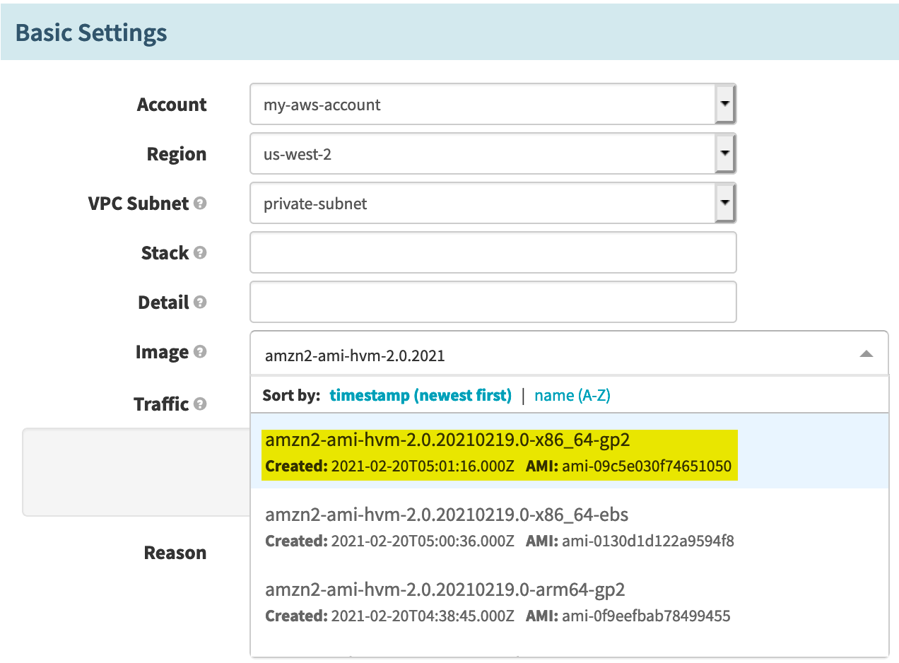

Lets attach the targetgroup *demoapp-targetgroup* created earlier by selecting that from the dropdown.

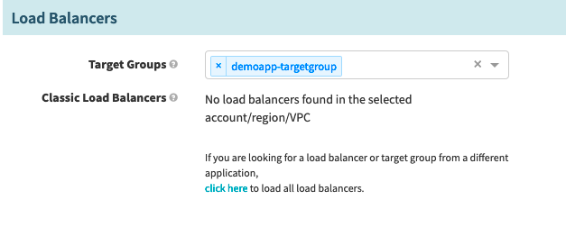

Select the *Demo-EC2-SecurityGroup* for the Firewalls which allows http traffic only from the ALB.

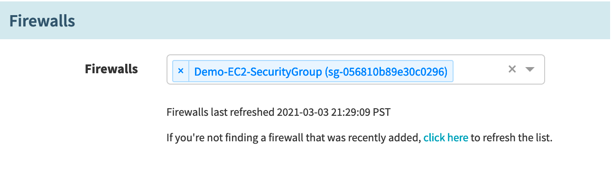

Lets select instance types m4.large, m5.large, m5a.large, t2.large, t3.large, t3a.large that has vCPU:RAM Ratio of 1:4. You can use Amazon Instance Selector (https://github.com/aws/amazon-ec2-instance-selector), a CLI tool to find a list of Instance Types that meets you criteria like vcpus and memory.

Select the Spot Allocation Strategy as *Capacity optimized,* Lets configure an On-Demand Base Capacity of *3* and On-Demand Percentage Above Base Capacity as *0%.*

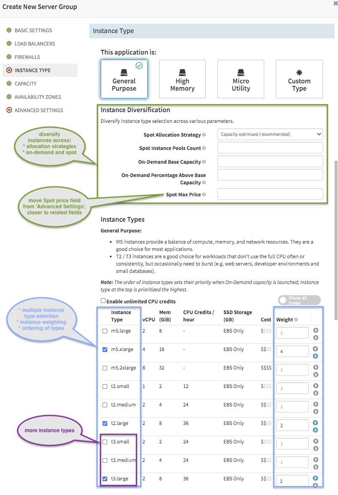

Set the Desired to *6*, Min to *3* and Max to *9* by clicking on Advanced Mode. 

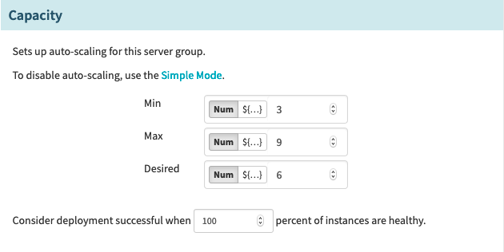

Leave everything default in the Avavailability Zone section to deploy the application into multiple Availability Zones for high availability.  

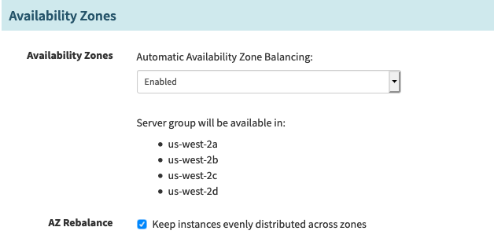

Select the an existing *Key Name*, leave the default *IAM Instance Profile* and use the below base64 encoded *UserData* to install httpd and add instance metadata into the index.html. Click *Create*

```
IyEvYmluL2Jhc2gNCnl1bSB1cGRhdGUgLXkNCnl1bSBpbnN0YWxsIGh0dHBkIC15DQplY2hvICI8aHRtbD4NCiAgICA8aGVhZD4NCiAgICAgICAgPHRpdGxlPkFtYXpvbiBTYW1wbGUgQXBwPC90aXRsZT4NCiAgICAgICAgPHN0eWxlPmJvZHkge21hcmdpbi10b3A6IDQwcHg7IGJhY2tncm91bmQtY29sb3I6ICNmZjgwMDA7fSA8L3N0eWxlPg0KICAgIDwvaGVhZD4NCiAgICA8Ym9keT4NCiAgICAgICAgPGgyPkFtYXpvbiBTYW1wbGUgQXBwbGljYXRpb248L2gyPg0KICAgICAgICA8dWw+DQogICAgICAgICAgICA8bGk+aW5zdGFuY2UtaWQ6IDxiPiBgY3VybCBodHRwOi8vMTY5LjI1NC4xNjkuMjU0L2xhdGVzdC9tZXRhLWRhdGEvaW5zdGFuY2UtaWRgIDwvYj48L2xpPg0KICAgICAgICAgICAgPGxpPmluc3RhbmNlLXR5cGU6IDxiPiBgY3VybCBodHRwOi8vMTY5LjI1NC4xNjkuMjU0L2xhdGVzdC9tZXRhLWRhdGEvaW5zdGFuY2UtdHlwZWAgPC9iPjwvbGk+DQogICAgICAgICAgICA8bGk+aW5zdGFuY2UtbGlmZS1jeWNsZTogPGI+IGBjdXJsIGh0dHA6Ly8xNjkuMjU0LjE2OS4yNTQvbGF0ZXN0L21ldGEtZGF0YS9pbnN0YW5jZS1saWZlLWN5Y2xlYCA8L2I+PC9saT4NCiAgICAgICAgICAgIDxsaT5hdmFpbGFiaWxpdHktem9uZTogPGI+IGBjdXJsIGh0dHA6Ly8xNjkuMjU0LjE2OS4yNTQvbGF0ZXN0L21ldGEtZGF0YS9wbGFjZW1lbnQvYXZhaWxhYmlsaXR5LXpvbmVgIDwvYj48L2xpPg0KICAgICAgICA8L3VsPg0KICAgIDwvYm9keT4NCjwvaHRtbD4iID4gL3Zhci93d3cvaHRtbC9pbmRleC5odG1sDQpzeXN0ZW1jdGwgc3RhcnQgaHR0cGQNCnN5c3RlbWN0bCBlbmFibGUgaHR0cGQ=
```

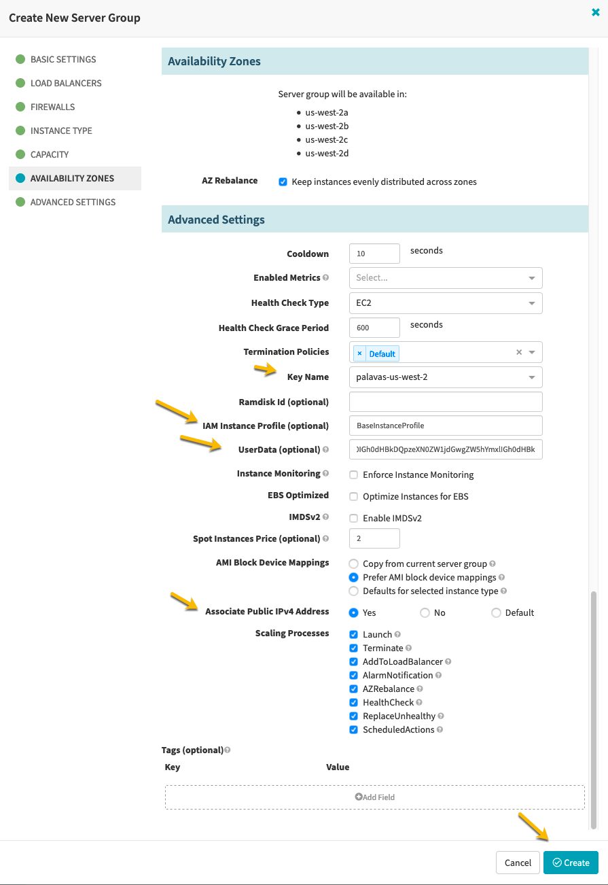

Spinnaker will create a Launch Template with the specification, an Auto Scaling group and wait until the ELB health check is  passed to send traffic to the EC2 Instances.

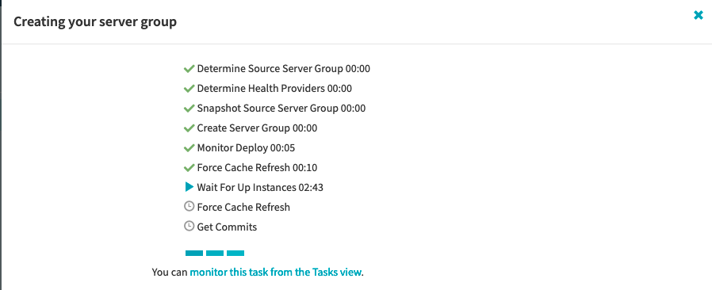

You can see the instances in green after they are health.

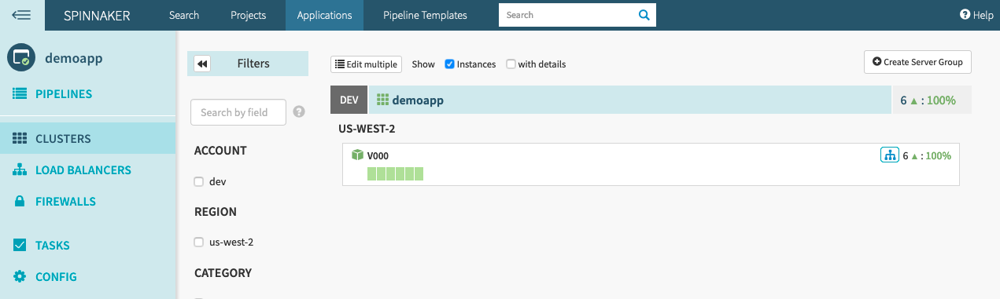

## Access the Application

Copy the Load Balancer URL by clicking on the tree icon on the right hand side on top of the Server Group and access it in a browser. You can refresh multiple times to see the requests are going to different instance everytime.


Congratulations! you have successfully deployed an application using Spinnaker on Amazon EC2. You can create, clone, disable and destroy a ServerGroups in a pipeline to effectively release new versions of your application.


## Cost Savings

You can quickly check the savings by deploying the application on EC2 Spot Instances by going to *EC2 console > Spot Requests > Saving Summary.*

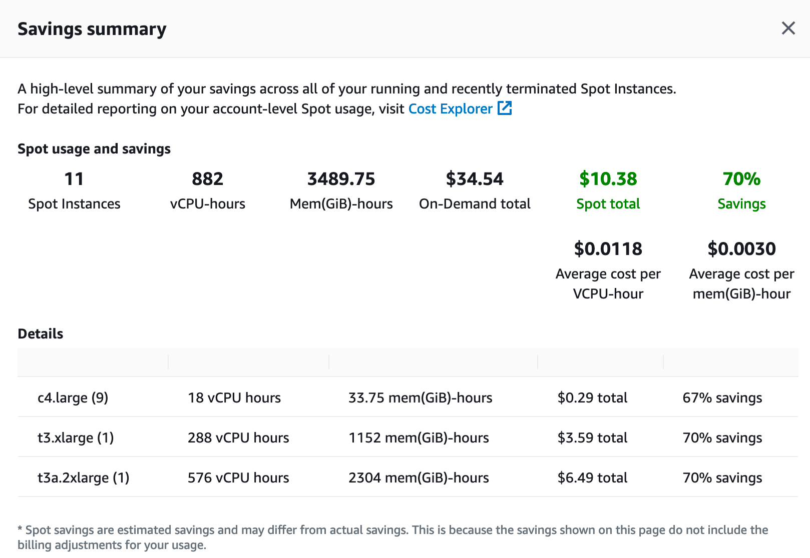

## Cleanup

### Delete the Server Group

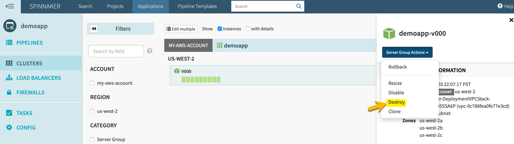

### Delete the Load Balancer

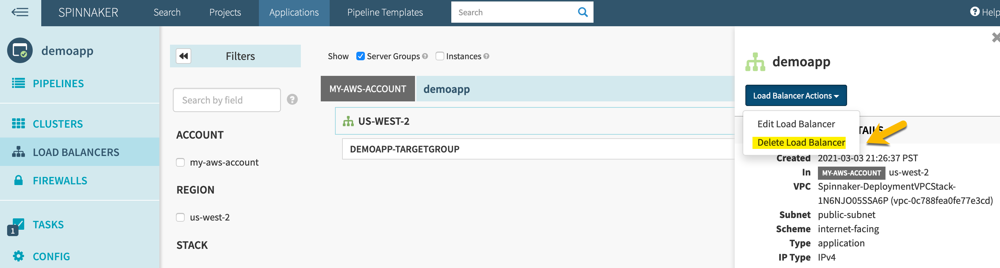

### Delete the Cloudformation stack

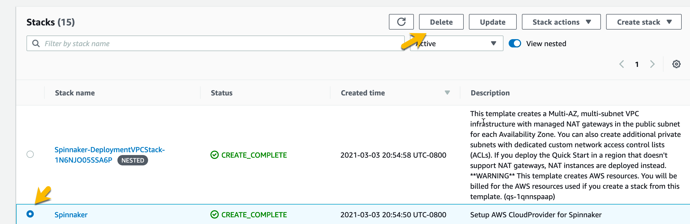

